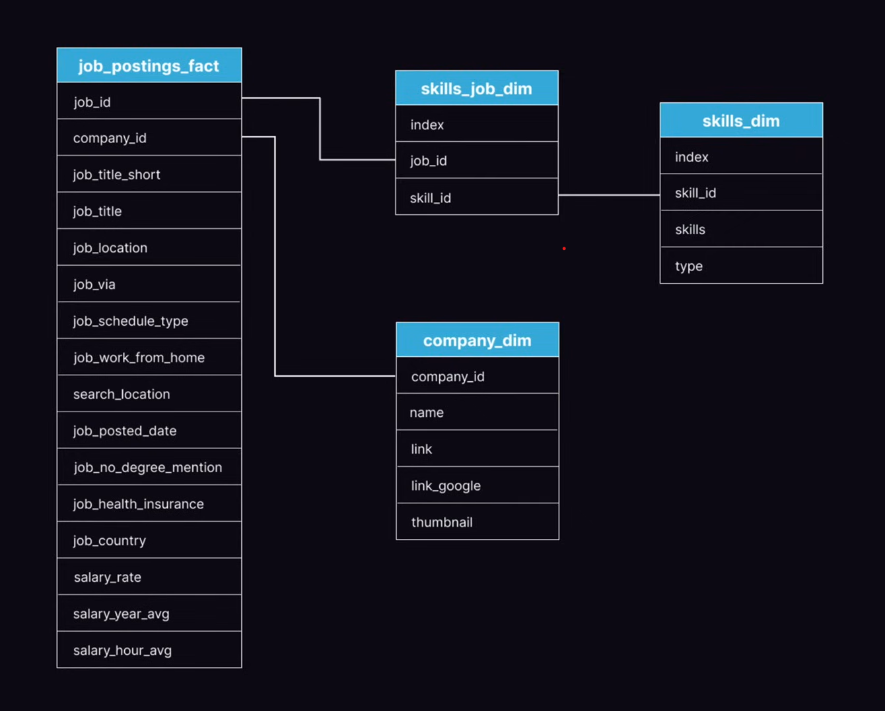

# Introduction

Dive into the data job market! Focusing on data analyst roles, this project explores top-paying jobs, in-demand skills, and where high demand meets high salary in data analytics.

SQL queries? Check them out here: [queries](/queries/)

# Background

Driven by a quest to navigate the data analyst job
market more effectively, this project was born
from a desire to pinpoint top-paid and in-demand
skills, streamlining others work to find optimal
jobs.
### Table Structure


### The questions I wanted to answer through my SQL queries were:
1. What are the top-paying data analyst jobs?

2. What skills are required for these top-paying
jobs?

3. What skills are most in demand for data
analysts?

4. Which skills are associated with higher
salaries?

5. What are the most optimal skills to learn?


# Tools I Used

For my deep dive into the data analyst job market,
I harnessed the power of several key tools:

- **SQL**: The backbone of my analysis, allowing me to
query the database and unearth critical insights.
- **PostgreSQL**: The chosen database management
system, ideal for handling the job posting data.
- **Visual Studio Code**: My go-tq for database
management and executing SQL queries.

- **Git & GitHub**: Essential for version control and
sharing my SQL scripts and analysis, ensuring
collaboration and project tracking.


# The Analysis

Each query for this project aimed at investigating
specific aspects of the data analyst job market.
Here's how I approached each question:

### 1. Top Paying Data Analyst Jobs

To identify the highest-paying roles I filtered data analyst positions by average yearly salary and location, focusing on remote jobs. This query highlights the high paying opportunities in the field.

``` sql

SELECT
    job_id,
    job_title,
    job_location,
    job_schedule_type,
    salary_year_avg,
    job_posted_date,
    name AS company_name

FROM
    job_postings_fact

LEFT JOIN company_dim -- joining to company_dim table to get
    ON job_postings_fact.company_id = company_dim.company_id

WHERE
    job_title_short = 'Data Analyst'
    AND job_location = 'Anywhere'
    AND salary_year_avg IS NOT NULL

ORDER BY salary_year_avg DESC

LIMIT 10

```

Here's the breakdown of the top data analyst jobs in 2023:
- **Wide Salary Range:** Top 10 paying data |
analyst roles span from $184,000 to $650,000, |
indicating significant salary potential in the
field. |
- **Diverse Employers:** Companies like SmartAsset, Meta, and AT&T are among those offering high salagies, showing a broad interest across different industries.
- **Job Title Variety:** There's a high diversity in job titles, from Data Analyst to Director of Analytics, reflecting varied roles and specializations within data analytics.


*Bar graph visualizing the salary for the top 10 salaries for data analysts; ChatGPT generated this graph from my SQL query results 1


/////


### 2. Top Paying Data Analyst Jobs Skills

``` sql

WITH top_paying_jobs AS (

    SELECT
        job_id,
        job_title,
        salary_year_avg,
        name AS company_name

    FROM
        job_postings_fact

    LEFT JOIN company_dim -- joining to company_dim table to get
        ON job_postings_fact.company_id = company_dim.company_id

    WHERE
        job_title_short = 'Data Analyst'
        AND job_location = 'Anywhere'
        AND salary_year_avg IS NOT NULL

    ORDER BY salary_year_avg DESC

    LIMIT 10
)

SELECT
    top_paying_jobs.*,
    skills

FROM top_paying_jobs

INNER JOIN skills_job_dim
    ON top_paying_jobs.job_id = skills_job_dim.job_id

INNER JOIN skills_dim
    ON skills_job_dim.skill_id = skills_dim.skill_id

ORDER BY
    salary_year_avg DESC


```

Data-centric skills dominate: SQL, Python, R, Pandas, and Tableau highlight a strong emphasis on data analysis, data science, and visualization.

Cloud & Big Data tools: Snowflake, Azure, and Databricks show demand for cloud-based data infrastructure expertise.

Programming versatility: Python and R are both prominent—Python slightly more dominant, signaling its wider adoption in industry.

Business + Tech balance: Excel still ranks high, reflecting the continuing importance of business-friendly tools alongside advanced technologies.


/////


### 3. Top In Demand Skills

``` sql
SELECT
    skills,
    COUNT(skills_job_dim) AS demand_count

FROM job_postings_fact

INNER JOIN skills_job_dim
    ON job_postings_fact.job_id = skills_job_dim.job_id

INNER JOIN skills_dim
    ON skills_job_dim.skill_id = skills_dim.skill_id

WHERE
    job_title_short = 'Data Analyst'

GROUP BY
    skills

ORDER BY
    demand_count DESC

LIMIT 5


```

SQL is #1: Still the backbone of data management and analysis, appearing in the highest number of postings.

Excel remains crucial: Despite more advanced tools, Excel is indispensable for business operations and reporting.

Python rising strong: Dominates for programming, automation, and data science.

Visualization is key: Tableau and Power BI show employers value professionals who can communicate data insights effectively.

Business + Tech combo: The mix of Excel (business-oriented) with Python/SQL (technical) highlights a demand for hybrid skill sets.


### 4. Top In Paying Skills

``` sql

SELECT
    skills,
    ROUND(AVG(salary_year_avg), 0) AS average_salary

FROM job_postings_fact

INNER JOIN skills_job_dim
    ON job_postings_fact.job_id = skills_job_dim.job_id

INNER JOIN skills_dim
    ON skills_job_dim.skill_id = skills_dim.skill_id

WHERE
    job_title_short = 'Data Analyst'
    AND salary_year_avg IS NOT NULL

GROUP BY
    skills

ORDER BY
     average_salary DESC

LIMIT 100

```


# What I Learned

# Conclusions